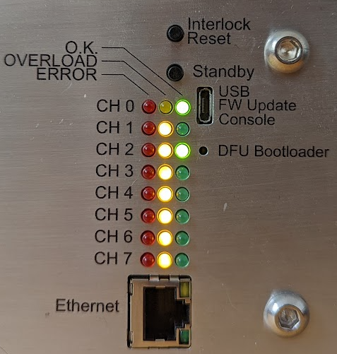

# Front Panel

<-- TOC -->

The front panel of Booster is used to physically clear channel interlocks to enable channels. It is also used to power down Booster and observe the operational status of the
channels and ethernet interface.

## User Buttons
There are two buttons on the front of booster. One is labeled "Interlock Reset" and the other is
labeled "Standby".

The "Standby" button places all channels into an RF-disabled state. In this state, the channel is
not powered and no output will be generated. Pressing the "Standby" button repeatedly will not have
any effect.

The "Interlock Reset" has the effect of powering up all of the channels and resetting any tripped
interlocks. After powering up, channels require a few hundred milliseconds to fully enable, so there
is a short delay after the button press before outputs fully enable. The "Interlock Reset" button
may be pressed while all channels are already powered to reset any tripped interlocks to re-enable
RF output.

There is also a much smaller, recessed button labeled "DFU Bootloader". This button may be pressed
while power is cycled to Booster to force the device into DFU mode. Booster NGFW exposes a mechanism
to reset to DFU mode via the USB port, so this button is not generally necessary.

# Channel LED Indications

Each output channel is composed of 3 LEDs - one red, one yellow/orange, and one green. If no RF
module is installed for a given channel, no LEDs on the channel will be illuminated. If an RF
channel is detected, at least one of the LEDs will illuminate.

The red LED is illuminated if a channel fault is detected. A fault cannot be cleared by the
"Interlock Reset" button, the channel is powered down, and the channel cannot be used. The only way
to clear this type of error is to power cycle Booster. The red LED nominally indicates a fault at a
hardware level that likely requires further investigation. Any indication of the red LED should
warrant further investigation of the device.

The yellow LED and the green LED are used to indicate the status of a 
channel. When the yellow LED is illuminated, the RF input is disabled on the channel. When a
channel is in standby or powered down, the yellow LED will illuminate without the green LED.

The green LED indicates that the channel is powered.  If only the green LED is illuminated,
the channel is operational and outputting normally. If the green LED and the yellow LED are both
illuminated, this indicates that an channel interlock has tripped. The channel may be reset from
this state by pressing the "Interlock Reset" button.

### Example

_Figure 1_: Sample Booster front-panel indications.

In the example above, it can be seen that CH0 is enabled.

Channel 2 is enabled, but one of the protection interlocks has tripped. This channel interlock can
be cleared by pressing the "Interlock Reset" button after the trip source has been removed.

Channels 1 and 3-7 are all powered up, but outputs are disabled.

# Ethernet Port

The ethernet port contains a green and an orange/yellow LED. The yellow LED illuminates when Booster
has successfully connected with an ethernet switch. The green LED will flash whenever there is
ethernet traffic detected.

# USB Port

The USB port on booster enumerates as a serial port and can be opened with any terminal emulation
program (e.g. Pyserial's miniterm, TeraTerm, picoterm, putty, or your desired serial port reader).
The USB port serves two purposes:
* Human-readable logging
* Basic network and MQTT configuration

No control of the channels is exposed over the USB serial port. Channels may only be controlled
over MQTT or through the front-panel buttons.

When connecting to the USB port, a help menu is displayed to the user to outline what can be
configured over the USB port. Any configuration made over the USB port will not take effect
immediately - in order for new configurations to apply, booster must be reset.

The USB port allows for configuration of:
* The MQTT ID of Booster
* The MQTT broker IP address
* Default fan speeds

Additionally, the USB port allows the user to:
* Read the MAC address
* Reboot the device
* Enter DFU mode remotely for upgrading firmware over USB
* Request device service information
